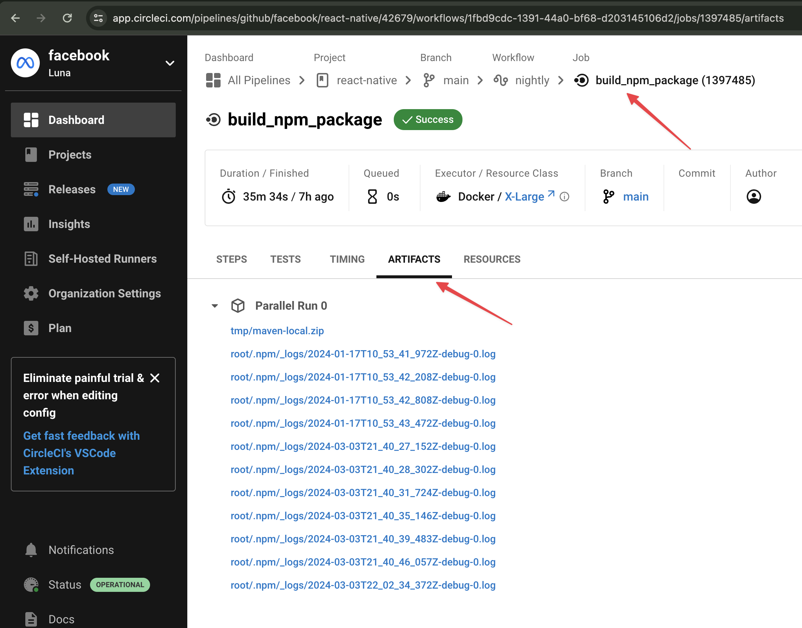
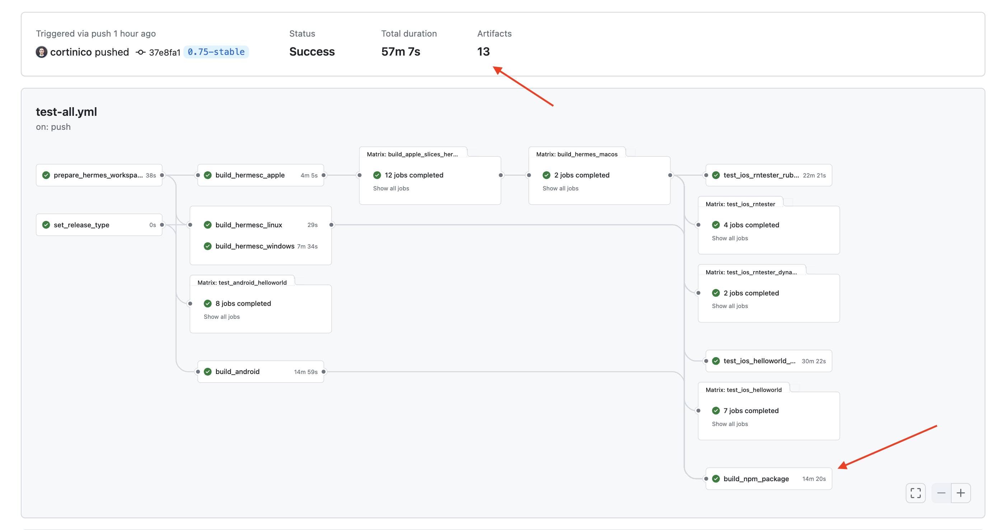

# Notable Call-outs / Gotchas

## CircleCI handles publishing

All npm registry and Maven publishes occur on CircleCI for version < 0.74. CircleCI publishes all monorepo
If you there has been an error in publishing, you'll need to flag to Meta release-crew to address.

## CircleCI artifacts

CircleCI builds artifacts, like `RNTester.apk` or Hermes binaries, that we can use in release testing to avoid building locally ourselves. This significantly speeds up release testing.

To use these CircleCI artifacts, you'll pass your [CircleCI token](./roles-and-responsibilities.md#circleci-personal-token) to the [testing script](./guide-release-testing.md#generating-the-projects).
The artifacts are built under the `build_npm_package` job and the job must be successful us to be able to use the artifacts.

<figure>

<figcaption>A workflow that has a successful `build_npm_package` job. Note that this workflow is `nightly`, but is used to illustrate the UI. Every push to CircleCI will run the `build_npm_package` job.</figcaption>
</figure>

## CircleCI only runs 1 workflow at a time

CircleCI will only **run 1 workflow at a time** for any branch that is non-`main`. If you push to a release branch, it will cancel any running workflow on that branch and trigger a new one.

This means if you are waiting for a workflow to do some work like publish or build artifacts, you **must wait** for that workflow to complete before you can push new changes. Otherwise, it will cancel that work.

## Github Actions handles publishing

All npm registry and Maven publishes occur on Github Actions for version >= 0.75. Github Actions publishes all monorepo
If you there has been an error in publishing, you'll need to flag to Meta release-crew to address.

## Github Actions artifacts

Github Actions builds artifacts, like `RNTester.apk` or Hermes binaries, that we can use in release testing to avoid building locally ourselves. This significantly speeds up release testing.

To use these Github Actions artifacts, you'll pass your [Github token](./roles-and-responsibilities.md#github-personal-token) to the [testing script](./guide-release-testing.md#generating-the-projects).
The artifacts are built under the `build_npm_package` job and the job must be successful us to be able to use the artifacts.

<figure>

<figcaption>A workflow that has a successful `build_npm_package` job. Every push to Github will run the `build_npm_package` job.</figcaption>
</figure>
