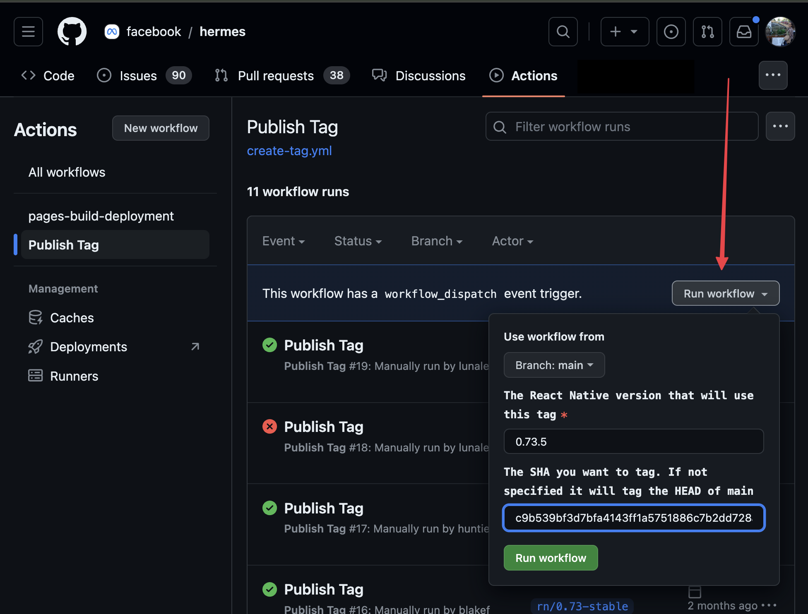

# Publish and Pick a Hermes Release

> [!Important]
> Only Meta release crew should publish Hermes releases. If you are a community releaser that is picking a Hermes pick request, ping a Meta release crew member to publish the Hermes release.

Prerequisites: You'll need access to the [Hermes repo](https://github.com/facebook/hermes). You can give yourself permission via the Meta Internal OSS dashboard.

See the guide you need, based on the React native release you are running:
- [React Native >= 0.83](#for-react-native--083)
- [React Native < 0.82](#for-react-native--082)

## For React Native >= 0.83

Starting from React Native 0.83, we need to have two tags for Hermes:
- A tag for the (legacy) Hermes
- A tag for HermesV1

We decoupled the build of Hermes from the React Native repository and we can now consume Hermes binaries that are produced in the Hermes repository

### Step 1: Check-out or create the (Legacy) Hermes release branch

#### If you are cutting a release candidate
Create a Hermes release branch of the form `rn/<major>.<minor>-stable` from latest `main`.

Make sure your branch is pushed to the remote.

```
# Run this in the Hermes repo:
git checkout main
git pull origin main
git checkout -b rn/0.76-stable
git push origin HEAD
```

### Step 2: Cherry-pick

#### For (Legacy) Hermes

> [!Important]
> If you cutting a release candidate, skip this step

1. Pick the relevant commits onto that branch. The pick requests should be from `main` and no other branch on Hermes.
2. Push the picks to the remote branch.

#### For HermesV1

> [!Important]
> If you cutting a release candidate, skip this step

1. Checkout the `250829098.0.0-stable` branch.
2. Pick the relevant commits onto that branch. The pick requests should be from `static_h` and no other branch on Hermes.
3. Push the picks to the remote branch.

### Step 3: Build Hermes and Publish Tag

Navigate to the [RN Build Hermes](https://github.com/facebook/hermes/actions/workflows/rn-build-hermes.yml) and run the workflow twice.
This workflow:
- builds the Hermes artifacts;
- publishes them on maven;
- publishes the hermes-compiler to NPM;
- publish the tag on GitHub

The tag will be created as last step, and we need to wait for the whole process to end before React Native can start the Release.

#### For (Legacy) Hermes

1. Set the branch to the release branch (e.g.: rn/0.83-stable)
2. Set the release type as `Release`

#### For Hermes V1

1. Set the branch to the Hermes V1 release branch: `250829098.0.0-stable`
2. Set the release type as `Release`

### Step 4: Bump the Hermes version on the React Native release branch

Using the newly generated Hermes tag run the following script on the React Native release branch:

```bash
# Replace <the_hermes_tag> with the tag that will look like 'hermes-2022-07-20-RNv0.70.0-bc97c5399e0789c0a323f8e1431986e207a9e8ba'
./packages/react-native/scripts/hermes/bump-hermes-version.js -t <the_hermes_tag> -s <the_hermes_v1_tag>
```

An example of the invocation is:
```
./packages/react-native/scripts/hermes/bump-hermes-version.js -t hermes-v0.14.0 -s hermes-v250829098.0.2
```

> [!Note]
> The script also support the `-h` parameter to specify the legacy Hermes version and the `-v` parameter to specify the Hermes V1 version.
> When not passed, the script will check the latest version of hermes published on NPM and will prompt for confirmation.

Add and commit the extra files that got created at:
- packages/react-native/sdks/.hermesversion
- packages/react-native/sdks/.hermesV1version
and updated at:
- packages/react-native/sdks/hermes-engine/version.properties
- packages/react-native/package.json

Now you can continue with the rest of your React Native release.

```
git add packages/react-native/sdks/.hermesvesion packages/react-native/sdks/.hermesv1vesion packages/react-native/sdks/hermes-engine/version.properties
git commit -m "Bump hermes version"
```

### Step 5: [Only for Branch Cut] Bump version on `main` and Hermes v1 release branch

The `main` branch and the `250829098.0.0-stable` should always track the next version that we are going to release.

After the build started and the tag is generated, bump the hermes-compiler versions on those branches:

#### For Legacy Hermes

From the `main` branch:
1. Create a separate branch `<username>/bump-hermes-compiler-to-0.X.0` (replace `<username>` and `X` with your gh username and the next minor version of Hermes)
1. Open the [`npm/hermes-compiler/package.json`](https://github.com/facebook/hermes/blob/ddd708a85b164d1841c024973d0f6d3fad60a4c2/npm/hermes-compiler/package.json) file
2. Bump the **minor** number by 1
3. Commit and push.
4. Open a PR on the Hermes repository
5. Import and land it.

#### For Hermes V1

From the `250829098.0.0-stable` branch
1. Open the [`npm/hermes-compiler/package.json`](https://github.com/facebook/hermes/blob/ddd708a85b164d1841c024973d0f6d3fad60a4c2/npm/hermes-compiler/package.json) file
2. Bump the **patch** number by 1
3. Commit and push.

---

## For React Native < 0.82

### Step 1: Check-out the Hermes release branch

Check out the Hermes release branch for your minor. It should be of the form `rn/<major>.<minor>-stable`.

> [!Tip]
> If one doesn't exist and you are not releasing a release candidate, use the [latest tag](https://github.com/facebook/hermes/tags) for your minor. Check out that tag, and create the branch of the form `rn/<major>.<minor>-stable`. We should be creating these during release candidate cuts.

### Step 2: Cherry-pick

> [!Important]
> If you cutting a release candidate, skip this step

Pick the relevant commits onto that branch. The pick requests should be from `main` and no other branch on Hermes.

Push the picks to the remote branch.

### Step 3: Publish Tag

Head to the [Publish Tag workflow](https://github.com/facebook/hermes/actions/workflows/create-tag-legacy.yml) in the Hermes repo.

Click the "Run Workflow" button. Run the workflow from `main`, input the React Native version you are releasing (e.g. 0.82.0, 0.82.1, etc), and the SHA of the head of your Hermes release branch.

<figure>

</figure>

Once the workflow is complete, it will create a new tag with the release you inputed and SHA. See [Hermes tags](https://github.com/facebook/hermes/tags)


## Step 4: Bump the Hermes version on the React Native release branch

Using the newly generated Hermes tag run the following script on the React Native release branch:

```bash
# Replace <the_hermes_tag> with the tag that will look like 'hermes-2022-07-20-RNv0.70.0-bc97c5399e0789c0a323f8e1431986e207a9e8ba'
./packages/react-native/scripts/hermes/bump-hermes-version.js -t <the_hermes_tag>
```

Add and commit the extra file that got created at `packages/react-native/sdks/hermes/.hermesversion`. Now you can continue with the rest of your React Native release.

```
git add packages/react-native/sdks/.hermesvesion && git commit -m "Bump hermes version"
```
