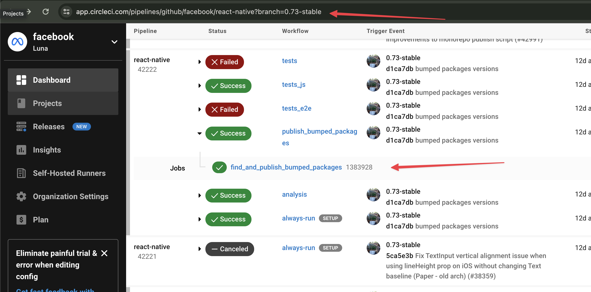

# Publish [Monorepo Packages](./glossary.md#monorepo-packages)

> [!Warning]
> For < 0.74, you'll need to publish any picks to monorepo packages **BEFORE** release testing. For >=0.74, you can test first but will need to complete these steps **BEFORE** final `react-native` release.

## Step 1: Check if there are any monorepo changes

```bash
# Run in react-native repo on your release branch
yarn bump-all-updated-packages
```

If there are changes to monorepo packages, this script will ask you to confirm and commit these bumps to your local branch.

> [!Note]
> As a gut-check, the first time you run this, it should align to any pick requests/merges you made on the release branch. Just use the generic commit message.

If there are no detected changes, then there are no monorepo packages to update. You are done here and can continue with the general release.

## Step 2: Publish packages
Push the local commit to the remote release branch. This will trigger CI to publish these packages.

<figure>

<figcaption>Pushing the `yarn bump-all-updated-packages` commit to CircleCI on the 0.73 branch will trigger the `find_and_publish_bumped_packages` job which handles the npm publish.</figcaption>
</figure>

**Wait for this to complete, [see gotcha](./gotchas.md#circleci-only-runs-1-workflow-at-a-time).**

You can verify it is completed for all monorepo versions by running `print-packages` on your release branch and filtering by the minor of your release. The `--minor` flag will pull the latest version on npm registry of that minor.

This means that if your `main` (on your release branch) and the minor column match versions, then everything has been published.

<figure>

<figcaption>Running `yarn print-packages` in your release branch.</figcaption>
</figure>

> [!Note]
> If you are releasing for version >=0.74, you are done here.

## Step 3. Repeat

> [!Warning]
> Only do this if you are releasing for versions < 0.74

Once CI completes publishing those packages, *repeat steps 1-3* until `yarn bump-all-updated-packages` no longer reports any changes to monorepo packages.

> [!Note]
> The reason why we need to repeat steps 1-3 is because for React Native < 0.74, the `yarn bump-all-updated-packages` script does not identify transitive dependencies on first run. This has been fixed for 0.74+