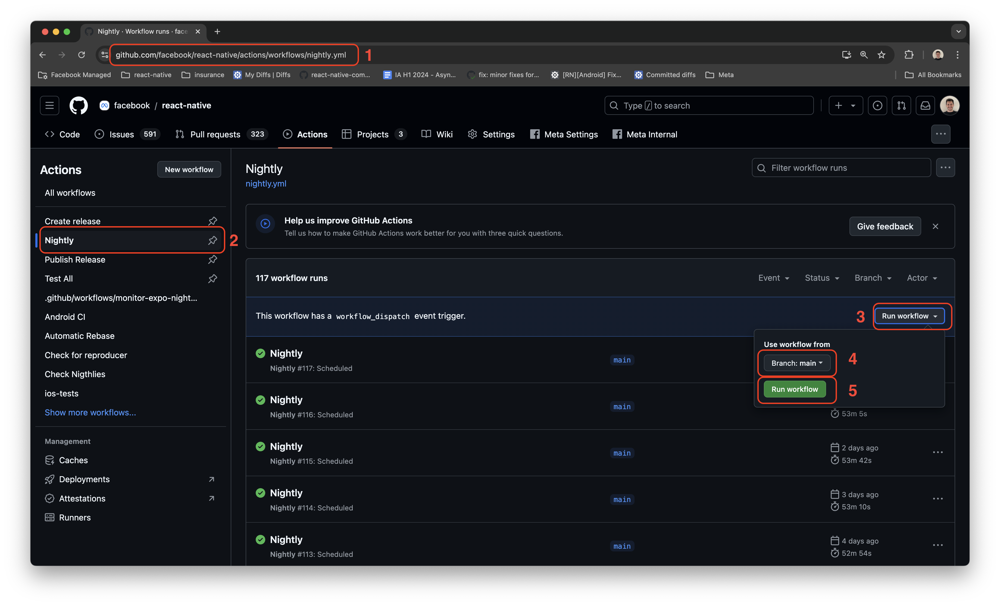

# Releasing Release Candidate

> [!Note]
> Release Candidates will primarily handled by Meta release crew. Community releasers can aid in testing and triaging issues.

The general stages for handling a release candidate:

1. [Cut a release candidate](#cut-a-release-candidate)
2. [Release patches on release candidate](#release-patches-on-release-candidate)
3. [Promote release candidate to stable](#promote-release-candidate-to-stable)

## Pre-requisites

- Write access to [react-native](https://github.com/facebook/react-native) repository.
- Write access to [template](https://github.com/react-native-community/template) repository.
- Write access to [cli](https://github.com/react-native-community/cli) repository.
- Write access to [hermes](https://github.com/facebook/hermes) repository.
- Write access to [releases](https://github.com/reactwg/react-native-releases) repository.
- One CircleCI personal API token - see [here](https://circleci.com/docs/managing-api-tokens#creating-a-personal-api-token) how to set one.

## Cut a Release Candidate

### 0. Update External Dependencies

Add a new column for this release candidate in the [External Dependencies Supported table](./support.md#external-dependencies-supported). Follow up internally if unsure.

### 1. Create a new release branch

- Check-out a clone of `react-native` repo
- Pull `main`
- Create a release branch. It must be of the form `<major>.<minor>-stable`

```bash
git checkout main
git pull origin main
git checkout -b 0.76-stable
```

**Create corresponding release branches in related community repos**

- [@react-native-community/cli](https://github.com/react-native-community/cli)
    - Example: `14.x` (refer to and update [this table](https://github.com/react-native-community/cli#compatibility))
- [@react-native-community/template](https://github.com/react-native-community/template)
    - Example: `0.76-stable`
 
> [!CAUTION]
> Make sure the CLI team ([#cli](https://discord.com/channels/514829729862516747/1232435652533031013) channel on discord) is aware of the upcoming branch cut.
> They are responsible of making sure the CLI is bumped **before RC1**.

With repo write permissions, you can do this from the GitHub UI.


### 2. Create a Hermes Release

- Follow instructions to [publish a Hermes release tag](./guide-hermes-release.md)
  - Make sure to have [committed the Hermes tag](./guide-hermes-release.md#step-4-bump-the-hermes-version-on-the-react-native-release-branch) to your release branch.

### 3. Trigger a nightly

Some partners are integrating with the nightlies jobs, so it's a good idea to trigger a nightly right before cutting the branch so that they can integrate with it before we push some release specific fixes in the Release branch.

To trigger a nightly:
1. Navigate to https://github.com/facebook/react-native/actions/workflows/nightly.yml
2. Select the `Nighly` action.
2. Click on `Run workflow`.
3. Keep the branch on `main`.
4. Click on `Run workflow`.



### 3. Follow the steps in the general release process

At this point, you'll follow the general release process from steps 4-13

### [4. Build Artifacts on CircleCI](./guide-release-process.md#step-4-build-artifacts-on-circleci)
### [5. Test the Release](./guide-release-process.md#step-5-test-the-release)
### [6. Publish Monorepo Packages](./guide-release-process.md#step-6-publish-monorepo-packages)
### [7. Publish React Native](./guide-release-process.md#step-7-publish-react-native)
### [8. Verify Release](./guide-release-process.md#step-8-verify-release)
### [9. Generate the Changelog PR](./guide-release-process.md#step-9-generate-the-changelog-pr)

> [!Note]
> The changelog for the release candidate may be quite long and will need some manual curation. In addition, the changelog parser can be flaky and mis-parse some commits. Here are guidelines for editing the changelog

#### Changelog Guidelines for Release Candidate

- Remove any commits that are marked "Internal" or are clearly not relevant to React Native OSS developers
  - Examples: commit on BUCK files or code refactoring that do not change behaviours or interfaces
- Delete dependency bump commits that are superceded by later version bumps.
  - Ex. Delete the commit for bumping X dependency to 0.7.0 if there is a commit to later bump X to 0.8.0
- At the end of the generated Changelog, there could be two additional sections: the **Failed to Parse** section and the **Unknown** section.
  - The **Unknown** section is populated with commit that landed without the `## Changelog:` entry in the summary.
  - The **Failed to Parse** section contains commits that has a `## Changelog:` entry in their summary but, due to typos or other problems, the tool was not able to parse and automatically attribute them to the right section.
  - For both these categories, we have to manually go through the listed commits and move them to the right section, based on the actual change they introduce.

### [10. Create Github Release](./guide-release-process.md#step-10-create-the-github-release)
### [11. Communicate Release](./guide-release-process.md#step-11-communicate-release)
### [12. Update podfile.lock on release](./guide-release-process.md#step-12-update-podfilelock-on-the-release-branch)
### [13. Update Github Project](./guide-release-process.md#step-13-update-github-project)
### 14. Bump minor version of all monorepo packages on `main`

Now we've cut a release branch, we need to update `main` monorepo packages and internal Meta dependencies to point to the "next" version.

In `fbsource` run
```bash
js1 publish react-native 0.<your-release-candidate-minor+1>.0-main

# ex. if you just released 0.78.0-rc.0, then
js1 publish react-native 0.79.0-main
```

This will update all the relevant packages to `0.78.0-main`

## Release patches on release candidate
You can follow the general release process for patches. The only thing to note is that your versioning scheme should be increasing the prerelease version.

ex. 0.78.0-rc.1 -> 0.78.0-rc.2

[See guide to release process](./guide-release-process.md)

## Promote release candidate to stable

Promoting a release candidate to stable is similar to releasing a patch. The difference is now we are releasing the new [latest version](./glossary.md#latest-version).

As well, there is follow-up in terms of writing a blog post and communicating to the ecosystem about this release.

### 1. Release a stable version following [release process](./guide-release-process.md)

### 2. Update the Support policy

Update the [support policy](./support.md#what-versions-are-currently-supported) for the new version.

- The first line should contain the `Next Release` and the status must be `Not Started`
- The other lines must be updated by bumping the versions in the first column by 1 minor

So, for example, if the table contains:

```diff
| Version     | Type                       | Status           |
| ----------- | -------------------------- | ---------------- |
-| 0.72.x     | Next version               | Future           |
-| 0.71.x     | Latest stable              | Active           |
-| 0.70.x     | Previous (-1) minor series | Active           |
-| 0.69.x     | Previous (-2) minor series | End of Cycle     |
-| <=0.68.x   | Old minor series           | Unsupported      |
+| 0.73.x     | Next version               | Future           |
+| 0.72.x     | Latest stable              | Active           |
+| 0.71.x     | Previous (-1) minor series | Active           |
+| 0.70.x     | Previous (-2) minor series | End of Cycle     |
+| <=0.69.x   | Old minor series           | Unsupported      |
```

### 3. Ship blog post

### 4. Update reactnative.dev and cut new version

- Head to [react-native-website](https://github.com/facebook/react-native-website)
- Make sure all relevant PRs for release candidate are merged
- Cut a new version of the website, [instructions](https://github.com/facebook/react-native-website#cutting-a-new-version)

### 5. Coordinate a release retrospective date & next release crew
