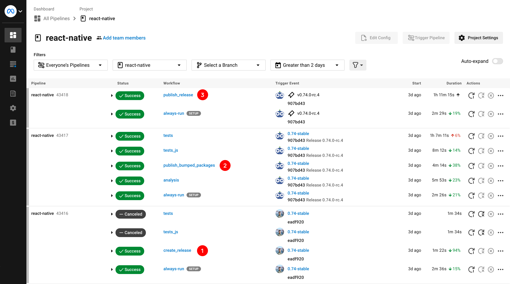

# Release Process (0.74 and later)

> [!Note]
> This documents the steps to releasing a stable React Native release.
>
> Release candidates will generally follow the same steps but have some pre and post work, depending on if you're cutting, doing a patch, or promoting a release candidate to stable.
>
> Follow the dedicated release candidate [guide](./guide-release-candidate.md) for more detail.

## Release steps

These steps apply when making a patch release or an incremental release candidate.

### Step 1: Check out release branch locally

From your local `facebook/react-native` clone, check out the relevant [release branch](./glossary.md#release-branch). Make sure your system is set up with the right [tooling dependencies](./support.md#external-dependencies-supported) for the release. e.g. you may need to switch Node versions.

```sh
# Fetch new commits and tags (to prep for any cherry-picks)
git fetch --all --tags

# Check out release branch
git switch <release-branch> # e.g. 0.74-stable

# OR, if checking out a release branch for the first time
git switch -c <release-branch> upstream/<release-branch>
```

### Step 2: Action cherry-picks and pull requests

New changes targeting a given release need to be replicated from `main` onto the release branch, via either a cherry-pick or pull request. See also [Releases Support Policy](./support.md#release-issues-and-pick-request-escalation).

```bash
# Make sure to update the release branch
git pull

# Cherry-pick relevant commits
git cherry-pick <commit-on-main>
```

> [!Warning]
> For any pick requests or merge requests for Hermes, notify a Meta Release Crew member. They'll need to publish and pick the [Hermes release](./guide-hermes-release.md) into the release branch. Do not proceed past step 3 until the the branch has been updated with the Hermes release.

### Step 3: Wait for CircleCI artifacts to build

Once all picks are complete, push your changes to the remote release branch.

```
git push
```

This will kick off a CircleCI workflow that will build relevant artifacts (Hermes prebuilts, `RNTester.apk`) that will expedite local testing.

[Navigate to CircleCI](https://app.circleci.com/pipelines/github/facebook/react-native) and wait for the `build_npm_package` job to complete successfully. If the job fails, try and fix the issue so that artifacts build.

> [!Important]
> Release testing will only use the artifacts from the last workflow that ran on your release branch! This means that if you push more changes to your release branch, you must wait for it to complete the `build_npm_package` job again to use those artifacts in testing.
>
> The takeaway here is to try and **avoid pushing more commits to CI at this point**. Otherwise, you'll have to wait for CI to build the assets again to use them in your testing.
>
> See [CircleCI Artifacts](./gotchas.md#circleci-artifacts) for more details.

### Step 4: Test the release

Follow the [Release Testing guide](./guide-release-testing.md). Ideally, we should have 2 Release Crew members test the release. Coordinate with another Release Crew member to do a second pass.

There may be exceptional cases where we can bypass 2 release tests or only do selective tests, based on circumstances. Ensure a Meta Release Crew member is aware and approves.

### Step 5. Create release (WIP update images)

```sh
yarn trigger-react-native-release \
  --to-version <YOUR_RELEASE_VERSION> # e.g. 0.74.1, 0.75.0-rc.1
  --token <YOUR_CIRCLE_CI_TOKEN>
```

The script will ask what npm tag you want to use:
- Select `latest` if you are publishing a patch on the [latest version](./glossary.md#latest-version).
- Select `<your-version>-stable` if publishing a patch on any other [stable version](./glossary.md#stable-version).
- The script should use `next` if you publishing a [release candidate](./glossary.md#release-candidate).

The script will then output a link to the created CI workflow.



1. `create_release` – Writes a release commit and tag, which will trigger the `publish_release` and `publish_bumped_packages` workflows.
3. `publish_bumped_packages` – Publishes all workspace packages (excluding `react-native`) to npm.
2. `publish_release` – Builds `react-native` package artifacts and publishes to npm.

> [!Tip]
> Look under "All Branches" filter to find the `publish_release` job. CircleCI locates this job outside of a given branch.

### Step 6: Verify Release (WIP update images)

Once all workflows above are complete, verify the following:

#### Verify npm publishes

Verify that `react-native` is published on npm with the correct tag.

```sh
npm view react-native

# Also verify that one or more subpackages are published
npm view @react-native/codegen
```

#### Init a new template app

Sanity check by initializing a new project and running for Android and iOS.

```
npx react-native@next init ReactNative<YOUR_VERSION> --version <YOUR_VERSION>
```

> [!Tip]
> Keep this project around somewhere incase you need to repro something on this version.

#### Verify Upgrade Helper is updated

The `publish_release` job should also trigger the `rn-diff-purge` GitHub action ([link](https://github.com/react-native-community/rn-diff-purge/actions/workflows/new_release.yml)). This action will update the [Upgrade Helper](https://react-native-community.github.io/upgrade-helper/) with a diff of your latest release patch. Verify your release is visible in the dropdown.


#### Verify assets have been uploaded to Maven

Verify release assets are uploaded to [Maven](https://repo1.maven.org/maven2/com/facebook/react/react-native-artifacts) for your release.

Note, this may take a moment to update. Later, we will link to some of these artifacts in the release notes.

- `https://repo1.maven.org/maven2/com/facebook/react/react-native-artifacts/<YOUR_VERSION>/react-native-artifacts-<YOUR_VERSION>-hermes-framework-dSYM-debug.tar.gz`
- `https://repo1.maven.org/maven2/com/facebook/react/react-native-artifacts/<YOUR_VERSION>/react-native-artifacts-<YOUR_VERSION>-hermes-framework-dSYM-release.tar.gz`

### Step 7: Generate the changelog PR

Now we need to update the [`CHANGELOG.md`](https://github.com/facebook/react-native/blob/main/CHANGELOG.md) file at the `react-native` repo root. This is generated using [`@rnx-kit/rn-changelog-generator`](https://github.com/microsoft/rnx-kit/tree/main/incubator/rn-changelog-generator).

> [!Note]
> Changelog commits must be submitted to the `main` branch.

```sh
# Check out `main` branch
git switch main

# Pull new tags
git fetch --all --tags

# Generate the changelog
npx @rnx-kit/rn-changelog-generator \
  --base v<LATEST_STABLE_OR_RC>\
  --compare v<YOUR_NEW_VERSION> \
  --repo . \
  --changelog ./CHANGELOG.md
```

You'll likely need to reformat the generated `CHANGELOG.md` changes and reorder the heading to keep the latest release ordering. Once done, create a PR with your changes against `main`.

### Step 8: Create the GitHub Release

Create a new [GitHub release](https://github.com/facebook/react-native/releases).

- Set the release tag to the newly created tag.
- Set the title to the release version (without preceding "v").
- Set release type:
  - Select "Set as a pre-release" if you releasing a release candidate.
  - Select "Set as the latest release" if you releasing a patch for the [latest version](./glossary.md#latest-version).
- Copy and paste the following template and update TODOs.

```md
<!-- TODO Copy and paste your formatted Changelog generated here. -->

---

<!-- TODO Update these links for your release version -->
Hermes dSYMS:
- [Debug](https://repo1.maven.org/maven2/com/facebook/react/react-native-artifacts/<YOUR_VERSION>/react-native-artifacts-<YOUR_VERSION>-hermes-framework-dSYM-debug.tar.gz)
- [Release](https://repo1.maven.org/maven2/com/facebook/react/react-native-artifacts/<YOUR_VERSION>/react-native-artifacts-<YOUR_VERSION>-hermes-framework-dSYM-release.tar.gz)

---

You can file issues or pick requests against this release [here](https://github.com/reactwg/react-native-releases/issues/new/choose).

---

To help you upgrade to this version, you can use the [Upgrade Helper](https://react-native-community.github.io/upgrade-helper/) ⚛️.

---

View the whole changelog in the [CHANGELOG.md file](https://github.com/facebook/react-native/blob/main/CHANGELOG.md).
```

### Step 9: Communicate Release

Send a message in the Core Contributors Discord `#release-coordination` channel about the new release.

```md
📢 0.X.Y release is out!

📦 https://github.com/facebook/react-native/releases/tag/v0.X.Y
📝 https://github.com/facebook/react-native/pull/<your-changelog-pr>
```

### Step 10: Update Podfile.lock on the release branch

Everytime we release a new version, there is a new `hermes-engine` version published. We need to update `packages/rn-tester` to use this new version. This is in preparation for the next release from this branch.

```bash
# Check out release branch
git switch <release-branch>

# Pull new changes (should include release commit from CI)
git pull

# Head to rn-tester package and update pods
cd packages/rn-tester
bundle exec pod update hermes-engine --no-repo-update

# Should contain updated packages/rn-tester/Podfile.lock
git commit -a -m "Update Podfile.lock" -m "Changelog: [Internal]"
git push
```

### Step 11: Update GitHub Project

Make sure you've updated the status of completed and ongoing tasks in the relevant [GitHub project](https://github.com/reactwg/react-native-releases/projects?query=is%3Aopen). Unresolved items can be assigned to the following release.

