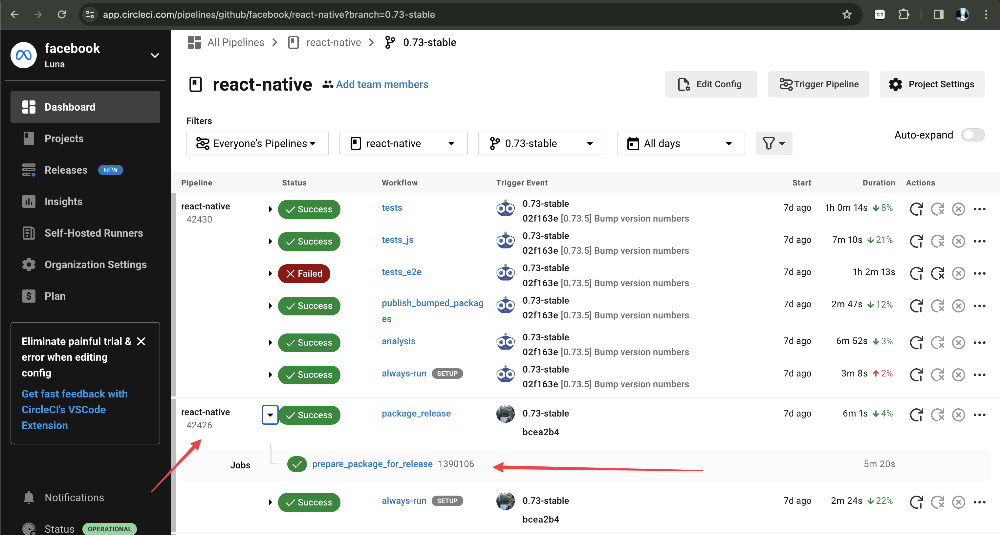
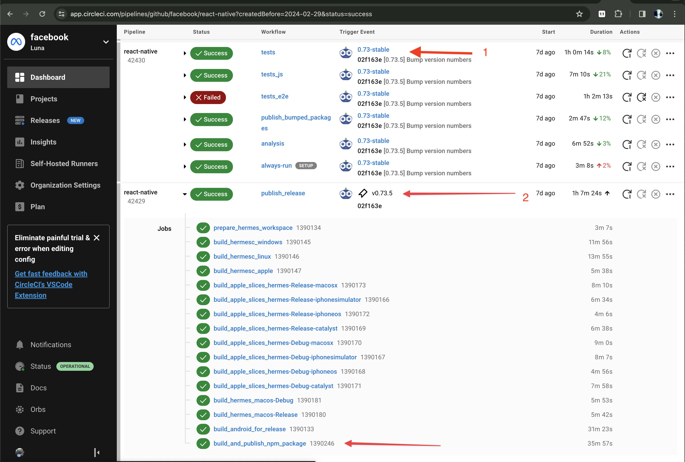
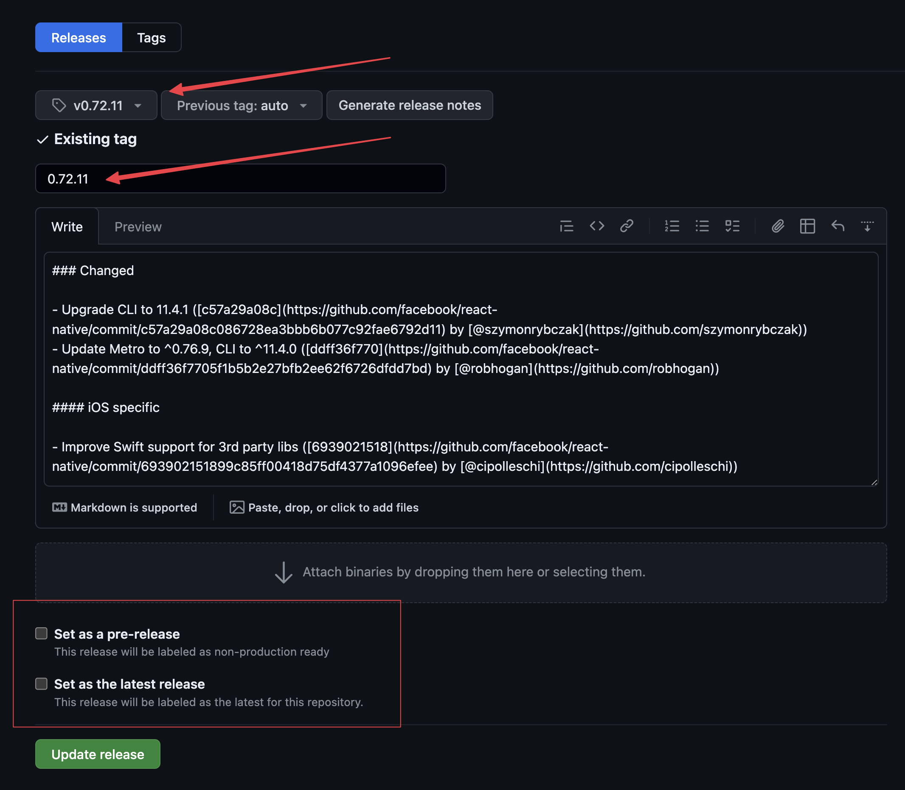

# General Release Process

> [!Note]
> This documents the steps to releasing a stable React Native release.
> 
> Release candidates will generally follow the same steps but have some pre- and post- work, depending on if you're cutting, doing a patch, or promoting a release candidate to stable.
> 
> Follow the dedicated release candidate [guide](./guide-release-candidate-cut.md) for more detail. Generally only Meta releasers will be doing release candidate releases.

## Release Steps

When the release crew has decided to ship a patch release, a release crew member will do some or all part of the following:

### Step 1: Check out the relevant release branch

From your `facebook/react-native` clone, update `main` and check out the relevant [release-branch](./glossary.md#release-branch) and tags.
Make sure you're using the right [dependency versions](./support.md#external-dependencies-supported) for the release. Ex. you may need to switch Node versions

```bash
# Update `main` and tags, to prep for any cherry-picks
git pull origin main

# Be on relevant release branch and any new tags
git pull origin <release-branch> --tags
git checkout -b <release-branch>
```

### Step 2: Cherry-pick or Merge requests against release branch

Following [general guidelines](./support.md#release-issues-and-pick-request-escalation) and/or guidance from Meta release-crew cherry-pick or merge requests against release branch.

> [!Warning]
> For any pick requests or merge requests for Hermes, notify a Meta release crew member. They'll need to publish and pick the [Hermes release](./guide-hermes-release.md) into the release branch. Do not proceed past step 3 until the the branch has been updated with the Hermes release.

It might help to first merge PRs, pull locally, and then do picks. Or pick commits in chronological order.

```bash
# Make sure to pull any merged PRs
git pull origin <release-branch>

## cherry pick relevant commits
git cherry-pick <commit-on-main>
```

### Step 3: Publish monorepo packages
> [!Warning]
> Only if you are releasing for versions < 0.74. For versions >= 0.74, you'll do this later.

Follow the steps to [publish monorepo packages](./guide-publish-monorepo.md). You'll need to do this **BEFORE** testing the release. Release testing will use these published versions.

### Step 4: Build artifacts on CircleCI
> [!Warning]
> Only do this once all monorepo packages have been published (for versions < 0.74) and once the Hermes release has been published and updated on this branch.

- Push any changes on your release branch to remote
  ```bash
  ex.
  git push origin 0.71-stable
  ```
- CI will build relevant artifacts (Hermes pre-builts, RNTester.apk) that will expedite your testing.
- You can view CI here: https://app.circleci.com/pipelines/github/facebook/react-native
  - Filter to your release branch
- Wait for the `build_npm_package` job to complete successfully. If the job fails, try and fix to get the artifacts to build. This will greatly speed up your testing.
- See [CircleCI artifacts](./gotchas.md#circleci-artifacts) for more details.

> [!Important]
> Release testing will only use the artifacts from the last workflow that ran on your release branch! This means that if you push more changes to your release branch, you must wait for it to complete the `build_npm_package` job again to use those artifacts in testing.
>
> The takeaway here is to try and **avoid pushing more commits to CI at this point**. Otherwise, you'll have to wait for CI to build the assets again to use them in your testing.

### Step 5: Test the release
See [release testing](./guide-release-testing.md).

Ideally, we should have 2 release crew members test the release. Coordinate with another release crew member to do a second pass.

There may be exceptional cases where we can bypass 2 release tests or only do selective tests, based on circumstances. Ensure Meta release crew is aware and approves.

### Step 6: Publish monorepo packages
> [!Warning]
> Only if you are releasing for versions >= 0.74

[Publish monorepo packages](./guide-publish-monorepo.md).

### Step 7. Publish `react-native`
```bash
# Run
yarn trigger-react-native-release --to-version <YOUR_RELEASE_VERSION> --token <YOUR_CIRCLE_CI_TOKEN>

# ex.
# yarn trigger-react-native-release --to-version 0.73.2 --token my-token
# yarn trigger-react-native-release --to-version 0.74.0-rc.2 --token my-token
```

The script will verify there are no changes to monorepo packages just to confirm you have [published monorepo packages](./guide-publish-monorepo.md).

> [!Warning]
> **Only for < 0.74**: If the script detects there are unpublished monorepo packages, this means your release testing didn't test picks to those monorepo packages :warning: You may need to publish the missing monorepo packages and re-test.

The script will ask what npm tag you want to use
- Select `latest` if you are publishing a patch on the [latest version](./glossary.md#latest-version).
- Select `<your-version>-stable` if publishing a patch on any other [stable version](./glossary.md#stable-version)
- The script should use `next` if you publishing a [release candidate](./glossary.md#release-candidate)

The script will then output a link to the CI workflow `package_release`

<figure>

<figcaption>CircleCI workflow <code>package_release</code>. This workflow will then trigger another workflow that actually publishes the release.</figcaption>
</figure>

Once `package_release` workflow is complete, it will trigger a workflow on the release branch to bump the version number (see "1" in figure), commit and tag the commit with the version. This new tag will then trigger a workflow to publish the release (see "2" in figure).

<figure>

<figcaption>"1" workflow will commit the tag "v0.73.5" which will then trigger workflow "2" to actually publish the release to npm and relevent assets to Maven.</figcaption>
</figure>

> [!Tip]
> Look under "All Branches" filter to find the publish job. It is not run on any "branch". CircleCI does not give a way to search for these jobs.

### Step 8: Verify Release

Once the `publish_release` workflow is complete, verify the following:

#### Verify NPM publishes

Verify that `react-native` is published on [npm](https://www.npmjs.com/package/react-native) with the correct tag.

Verify the monorepo packages are published via

```
yarn print-packages --type public --minor <YOUR_RELEASE_MINOR>
```

You should expect the `main` and `minor` column versions to match.

<figure>

<figcaption>Running <code>yarn print-packages</code> in your release branch.</figcaption>
</figure>

#### Sanity-check by init-ing a new template app

Sanity check by init-ing a new project and running for iOS/Android

```
npx react-native init ReactNative[YOUR_VERSION] --version <YOUR_VERSION>
```

> [!Tip]
> Keep these around somewhere incase you need to repro something on this version

#### Verify Upgrade Helper is updated

The `publish_release` job should also trigger the rn-diff-purge Github Action [link](https://github.com/react-native-community/rn-diff-purge/actions/workflows/new_release.yml)

This Github Action will update https://react-native-community.github.io/upgrade-helper/ to generate the diff of your latest release patch. Verify your release is visible in the dropdown.


#### Verify assets have been uploaded to Maven

Verify release assets are uploaded to [Maven](https://repo1.maven.org/maven2/com/facebook/react/react-native-artifacts) for your release.

Note, this may take a moment to update. Later, we will link to some of these artifacts in the release notes.

You will need the following links later:
- https://repo1.maven.org/maven2/com/facebook/react/react-native-artifacts/<YOUR_VERSION>/react-native-artifacts-<YOUR_VERSION>-hermes-framework-dSYM-debug.tar.gz
- https://repo1.maven.org/maven2/com/facebook/react/react-native-artifacts/<YOUR_VERSION>/react-native-artifacts-<YOUR_VERSION>-hermes-framework-dSYM-release.tar.gz

### Step 9: Generate the changelog PR

Now we need to update the [`CHANGELOG.md`](https://github.com/facebook/react-native/blob/main/CHANGELOG.md) file.

To generate the changelog, we rely on a dedicated tool called @rnx-kit/rn-changelog-generator that will parse the custom changelog messages that contributors write in their PRs.

> [!Note]
> We only update the changelog on `main` branch.

```bash
# Be on the `main` branch of your react-native clone
cd <REACT_NATIVE_REPO>
git co main

# 1. Pull new tags, make sure you see your new release tag pulled
git fetch --tags

# Run following with the stable release as base, and your patch version
npx @rnx-kit/rn-changelog-generator --base v[LATEST_STABLE]--compare v[YOUR_NEW_MINOR] \
--repo <PATH_TO_YOUR_REACT_NATIVE_REPO> --changelog <PATH_TO_YOUR_REACT_NATIVE_REPO>/CHANGELOG.md

# example against 0.68.2 and 0.68.3
npx @rnx-kit/rn-changelog-generator --base v0.68.2 --compare v0.68.3 \
--repo . --changelog ./CHANGELOG.md
```

This will update the CHANGELOG.md file your repo. You'll probably need to reformat this and re-order the heading to keep the reverse-latest releases ordering.

Once you've completed formatting, create a PR with your changes against `main`.

### Step 10: Create the Github Release

Create a new [Github release](https://github.com/facebook/react-native/releases).

- Select your release tag
- Title the release
- Copy and paste the following template and update TODOs

```markdown

<!-- TODO Copy and paste your formatted Changelog generated here. -->

---
<!-- TODO Update these links for your release version -->

Hermes dSYMS:
- [Debug](https://repo1.maven.org/maven2/com/facebook/react/react-native-artifacts/<YOUR_VERSION>/react-native-artifacts-<YOUR_VERSION>-hermes-framework-dSYM-debug.tar.gz)
- [Release](https://repo1.maven.org/maven2/com/facebook/react/react-native-artifacts/<YOUR_VERSION>/react-native-artifacts-<YOUR_VERSION>-hermes-framework-dSYM-release.tar.gz)

---

You can file issues or pick requests against this release [here](https://github.com/reactwg/react-native-releases/issues/new/choose)

---

To help you upgrade to this version, you can use the [upgrade helper](https://react-native-community.github.io/upgrade-helper/) ⚛️

---

You can find the whole changelog history in the [changelog.md file](https://github.com/facebook/react-native/blob/main/CHANGELOG.md).
```

> [!Important]
> Select "Set as a pre-release" if you releasing a release candidate
> Select "Set as the latest release" if you releasing a patch for the [latest version](./glossary.md#latest-version)




### Step 11: Communicate Release

Message the Core Contributors Discord #release-coordination about the new release
```markdown
Template for announcing release
📢 0.X.Y release is out!

📦 https://github.com/facebook/react-native/releases/tag/v0.X.Y
📝 https://github.com/facebook/react-native/pull/<your-changelog-pr>
```

### Step 12: Update Podfile.lock on the release branch

Everytime we release a new version, there is a new `hermes-engine` version published. We need to update `packages/rn-tester` to use this new version. This is in preparation for the next patch release on this release minor.

```bash
# Check out the release branch you just released
git co <release-branch>

# Update it, there will be some commits from the CI when it was published
git pull origin <release-branch> --ff-only

# Head to rn-tester package and update pods
cd packages/rn-tester
bundle exec pod update hermes-engine --no-repo-update

# It should update the Podfile.lock under packages/rn-tester
git st

Changes not staged for commit:
  (use "git add <file>..." to update what will be committed)
  (use "git restore <file>..." to discard changes in working directory)
	modified:   Podfile.lock
```

Commit this change to the release branch and push to remote

### Step 13: Update Github Project

Make sure you've updated what tasks you've completed, or what you're blocked on in the relevant [Github Project](https://github.com/reactwg/react-native-releases/projects?query=is%3Aopen)

