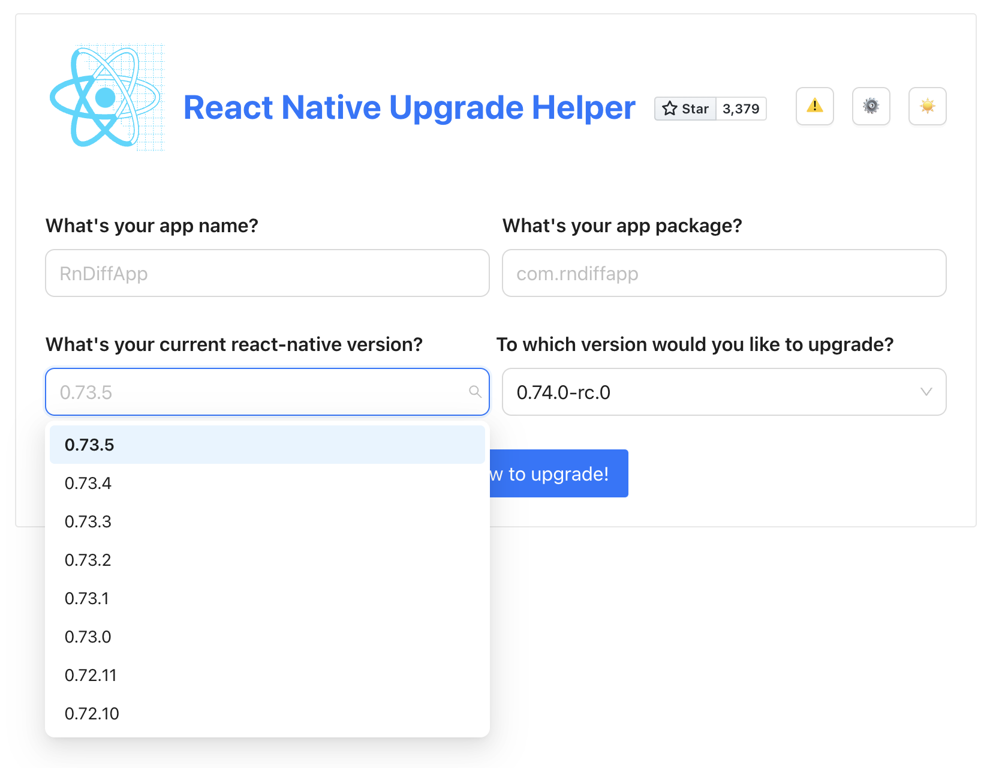

# Release Process (>= 0.75)

> [!Note]
> This documents the steps to releasing a **stable** React Native release.
>
> Release candidates will generally follow the same steps but have some pre and post work, depending on if you're cutting, doing a patch, or promoting a release candidate to stable.
>
> Follow the dedicated release candidate [guide](./guide-release-candidate.md) for more detail.

## Release steps

These steps apply when making a patch release or an incremental release candidate.  Typically we like to keep the *#release-crew* Discord channel up to date with progress.  You're free to do this however you'd like.  One method is it keep a progress message up-to-date (⌛ started, ✅ complete, 🚨 problem).  Here is the template used for 0.78.0-rc.0:

```md
# 0.78.0-rc.0

* ✅ Pick changes and push `0.78-stable`
* ⌛ Wait for `build_npm_package` (if <0.78) or `test_ios_rntester` (if >=0.78) to complete → https://github.com/facebook/react-native/actions/runs/12870884886
* ⌛ Verify that E2E tests are green → https://github.com/facebook/react-native/actions/runs/13634115054
* ⌛ (ONLY for RC0,1,4,stable) Test release → https://github.com/reactwg/react-native-releases/blob/main/docs/guide-release-testing.md
  * ⌛ <Tester Name>: https://github.com/reactwg/react-native-releases/issues/
* ⌛ Publish release job → https://github.com/facebook/react-native/actions/runs/12784528348
* ⌛ Verify template: npx @react-native-community/cli init + build for iOS + Android
* ⌛ Verify upgrade helper → https://react-native-community.github.io/upgrade-helper/?from=0.77.0-rc.6&to=0.78.0-rc.0
* ⌛ Verify Maven assets → https://repo1.maven.org/maven2/com/facebook/react/react-native-artifacts/0.78.0-rc.0
* ⌛ Generate changelog PR → https://github.com/facebook/react-native/pull/48685
* ⌛ Create GitHub release → https://github.com/facebook/react-native/releases/tag/v0.78.0-rc.0
  * ⌛ Verify DevTools Github Release Assets → https://github.com/facebook/react-native/actions/runs/17794492301
* ⌛ Communicate release to `releases-coordination` on Discord
* ⌛ Communicate release to `React Native Releases` on Workplace (Meta internal)
* ⌛ Update `Podfile.lock`
* ⌛ Update GitHub project
```

### Step 1: Check out release branch locally

From your local `facebook/react-native` clone, check out the relevant [release branch](./glossary.md#release-branch). Make sure your system is set up with the right [tooling dependencies](./support.md#external-dependencies-supported) for the release. e.g. you may need to switch Node versions.

```sh
# Fetch new commits and tags (to prep for any cherry-picks)
git fetch --all --tags

# Check out release branch
git switch <release-branch> # e.g. 0.75-stable

# OR, if checking out a release branch for the first time
git switch -c <release-branch> upstream/<release-branch>
```

### Step 2: Action cherry-picks and pull requests

New changes targeting a given release need to be replicated from `main` onto the release branch, via either a cherry-pick or pull request. See also [Releases Support Policy](./support.md#release-issues-and-pick-request-escalation).  New change **MUST** be reflected on the [release minor version project](https://github.com/orgs/reactwg/projects) before picking / merging:


Once the project is up to date, you can pick these locally:

```bash
# Make sure to update the release branch
git pull

# [Optionally] Use this tool to help order the cherry-picks and identify PRs
npx rn-release-info 0.76.5

# Cherry-pick relevant commits
git cherry-pick <commit-on-main>
```

> [!Warning]
> For any pick requests or merge requests for Hermes, notify a Meta Release Crew member. They'll need to publish and pick the [Hermes release](./guide-hermes-release.md) into the release branch. Do not proceed past step 3 until the the branch has been updated with the Hermes release.

### Step 3: Wait for Github Actions artifacts to build

Once all picks are complete, push your changes to the remote release branch.

```
git push
```

This will kick off a Github Action workflow called [Test All](https://github.com/facebook/react-native/actions/workflows/test-all.yml) that will build relevant artifacts (Hermes prebuilts, `RNTester.apk`) that will expedite local testing.

[Navigate to Github Actions](https://github.com/facebook/react-native/actions/workflows/test-all.yml) and wait for the `build_npm_package` job to complete successfully (~30min into the `test-all` workflow). If the job fails, try and fix the issue so that the artifacts build.


> [!Important]
> Release testing will only use the artifacts from the last workflow that ran on your release branch! This means that if you push more changes to your release branch, you must wait for it to complete the `build_npm_package` job again to use those artifacts in testing.
>
> The takeaway here is to try and **avoid pushing more commits to CI at this point**. Otherwise, you'll have to wait for CI to build the assets again to use them in your testing.
>
> See [Github Actions Artifacts](./gotchas.md#github-artifacts) for more details.

### Step 4: Test the release

Follow the [Release Testing guide](./guide-release-testing.md). 

* If you're releasing >= 0.79
  * We should have **1x Release Crew** member testing the release.
  * Additionally **only** the following releases should be manually tested.
    * `RC0`
    * `RC1`
    * `RC4` (Golden RC)
  * All the other releases require no manual testing.
  * You should ensure that the **E2E jobs** on the release branch are green.
* If you're releasing <= 0.78
  * We should have **2x Release Crew** members test the release. Coordinate with another Release Crew member to do a second pass.
  * There may be exceptional cases where we can bypass 2 release tests or only do selective tests, based on circumstances. **Ensure a Meta Release Crew member is aware and approves**.

### Step 5. Create release
Starting from React Native 0.75, a new release is created using a Github Action workflow called [Create Release](https://github.com/facebook/react-native/actions/workflows/create-release.yml).


The workflow requires 4 parameters:
1. The `branch` we need to use to cut the release. Make sure to set it to your stable branch. e.g.: `0.75-stable`
1. The `version` we want to publish. For example, `0.75.0-rc.0`.
1. Check the `latest` checkbox, if you are publishing a patch on the [latest version](./glossary.md#latest-version).
1. The last checkbox is for a dry-run. If you need to run a release, keep it unchecked.

This runs the *Create Release* workflow.  It'll sync package versions ([publish-bumped-packages.yml](https://github.com/facebook/react-native/blob/main/.github/workflows/publish-bumped-packages.yml)), commit and publish a tag ([create-release.yml](https://github.com/facebook/react-native/blob/main/.github/workflows/create-release.yml)):


The new tag will then launch a **Publish Release** ([publish-release.yml](https://github.com/facebook/react-native/blob/main/.github/workflows/publish-release.yml#L2-L6)) workflow which builds and publishes the `react-native` npm package artifact:


### Step 6: Verify Release

Once all workflows above are complete, verify the following:

#### Verify npm publishes

Verify that `react-native` is published on npm with the correct tag.

```sh
npm view react-native

# Also verify that one or more subpackages are published
npm view @react-native/codegen
```

#### Init a new template app

Sanity check by initializing a new project and running for Android and iOS.  We suggest setting the version as an environmental variable, having a [GitHub personal token](https://github.com/settings/tokens/new?description=React%20Native%20Releases&scopes=repo) and the [Github CLI tools](https://cli.github.com/) installed to make it easy to copy-pasta these verifications:

```
export NEW_VERSION="v0.76.0-rc.3" # Should be prefixed with a 'v'
export GITHUB_TOKEN=<your token>
```

Verify the `template` with the [version compatible with the release](https://github.com/react-native-community/cli#compatibility).

> [!Note]
> For a new release, you might need to use a pre-released version. (e.g **`20.0.0-alpha.0`**).
> 
> `npm view @react-native-community/cli versions` will print all available versions.

```
export VERSION=${NEW_VERSION#v}
export REACT_NATIVE_COMMUNITY_CLI_VERSION="^20.0.0"
npx @react-native-community/cli@${REACT_NATIVE_COMMUNITY_CLI_VERSION} init "ReactNative${VERSION//[.-]/_}" --version "$VERSION"
```

> [!Tip]
> Keep this project around somewhere incase you need to repro something on this version.

<details>
  <summary><b>Backup:</b> How do I manually create a template for this version?</summary>

Run the [Release](https://github.com/react-native-community/template/actions/workflows/release.yaml) workflow, making sure you use the correct branch.  For example with the `0.76.*` releases you would use the [0.76-stable](https://github.com/react-native-community/template/tree/0.76-stable) branch:


You will need separate additional permissions to do this, reach out to the **release crew** on Discord for help.

</details>

#### Verify Upgrade Helper is updated

The `publish_release` job should also trigger the `rn-diff-purge` GitHub action ([link](https://github.com/react-native-community/rn-diff-purge/actions/workflows/new_release.yml)). This action will update the [Upgrade Helper](https://react-native-community.github.io/upgrade-helper/) with a diff of your latest release patch. Verify your release is visible in the dropdown.



**Common Issues:**
<details>
  <Summary>Why can't I see the upgrade helper diff between last set of releases, e.g. 0.75.4 → 0.76.0-rc.3?</Summary>
  
  ### Cause:
  <code>rn-diff-purge</code> has to be run in order.  That means 0.75.4 must be run before 0.76.0-rc.3.  Sometimes during releases this can happen out of order when people don't anticipate having to coordinate.
  
  ### Fix:
  I'm going to use the above versions as examples, replace with your affected versions.
  1. Delete the tags:
  
  ```bash
  git push --delete origin 0.75.4
  git push --delete origin 0.76.0-rc.3
  ```
  
  2. Delete the versions from [RELEASES](https://github.com/react-native-community/rn-diff-purge/commit/1a42eedbd830ca3c2e0ae62247ad992df69bf16f)
  3. Manually <em>publish</em> by calling the Github action in order: 0.75.4 first then 0.76.0-rc.3
  4. Confirm this is fixed: [https://react-native-community.github.io/upgrade-helper/?from=0.75.4&to=0.76.0-rc.3](https://react-native-community.github.io/upgrade-helper/?from=0.75.4&to=0.76.0-rc.3)
</details>

<details>
  <summary><b>Manually Publish:</b> How do I add an entry in the Upgrade Helper for this version?</summary>
  If there is a failure and you manually want to add your new tag to the `upgrade helper`, use:

```bash
curl -X POST https://api.github.com/repos/react-native-community/rn-diff-purge/dispatches \
            -H "Accept: application/vnd.github.v3+json" \
            -H "Authorization: Bearer $GITHUB_TOKEN" \
            -d "{\"event_type\": \"publish\", \"client_payload\": { \"version\": \"$NEW_VERSION\" }}"
```
Confirm the [publish action](https://github.com/react-native-community/rn-diff-purge/actions) completes before verifying the upgrade helper has been updated.
</details>

#### Verify assets have been uploaded to Maven

Verify release assets are uploaded to [Maven](https://repo1.maven.org/maven2/com/facebook/react/react-native-artifacts) for your release.

Note, this may take a moment to update. Later, we will link to some of these artifacts in the release notes.

```bash
export VERSION=${NEW_VERSION#v}
curl -I https://repo1.maven.org/maven2/com/facebook/react/react-native-artifacts/$VERSION/react-native-artifacts-$VERSION-hermes-framework-dSYM-debug.tar.gz
curl -I https://repo1.maven.org/maven2/com/facebook/react/react-native-artifacts/$VERSION/react-native-artifacts-$VERSION-hermes-framework-dSYM-release.tar.gz
```

### Step 7: Update CHANGELOG.md

Now we need to update the [`CHANGELOG.md`](https://github.com/facebook/react-native/blob/main/CHANGELOG.md) file at the `react-native` repo root.

> [!Note]
> Changelog commits must be submitted to the `main` branch.

Starting from React Native (**`>= 0.80`**), the **Publish Release** action will generate a changelog PR such as `changelog/v0.80.0-rc.0` for you.

Reformat and re-style the modified `CHANGELOG.md` on that branch based on previous changelog PRs. Then, a Meta engineer should: 
1. Import the PR in the Meta internal system, 
2. Get the resulting diff approved, 
3. Land the diff into `main`.

If it fails, or for (**`< 0.80`**), manually generate the updated changelog on `main` and open a PR to `main` after similar reformatting:

<details>
  <summary>Manually Generate Changelog Updates</summary>
 
```bash
# Check out `main` branch
git switch main

# Pull new tags
git fetch --all --tags --force
git pull

BASE_VERSION=$(git tag -l --sort=-v:refname | grep -E '^v0\.' | head -n2 | tail -n1)

# Generate the changelog
npx @rnx-kit/rn-changelog-generator \
  --base $BASE_VERSION \
  --compare $NEW_VERSION \
  --repo . \
  --changelog ./CHANGELOG.md \
  --token $GITHUB_TOKEN
```
</details>

### Step 8: Create the GitHub Release

> [!Note]
> For large releases with many changelog changes such as RC0 (e.g. `0.81.0-rc.0`) or Major release (e.g. `0.81.0`) the link to CHANGELOG.md at the bottom of the Github release is enough.

For React Native (**`>= 0.80`**), a draft Github release is generated by the job [**Publish Release**](https://github.com/facebook/react-native/actions/workflows/publish-release.yml), you just have to verify all details are correct and publish it.

#### Verify DevTools Github Release Assets
The Publish Release job uploads several DevTools assets to the GitHub Release Assets to the GitHub release it creates.

Make sure that the action validating these, [Validate DotSlash Artifacts](https://github.com/facebook/react-native/actions/workflows/validate-dotslash-artifacts.yml), is green and the assets exist on the release:


If there are problems with the automatic draft release generation, or for (**`< 0.80`**), manually create a Github release:

<details>
  <Summary>Manually Github release creation process:</Summary>
  
#### Create a new [GitHub release](https://github.com/facebook/react-native/releases).
- Set the release tag to the newly created tag.
- Set the title to the release version (without preceding "v").
- Set release type:
  - Select "Set as a pre-release" if you releasing a release candidate.
  - Select "Set as the latest release" if you releasing a patch for the [latest version](./glossary.md#latest-version).
- Run the below template generation from the changelog commit, pasting it in the release description:

```bash

cat <<EOF | pbcopy
<!-- TODO Copy and paste your formatted Changelog generated here. -->
<!-- For large releases with many changelog changes such as first RC (e.g. `0.81.0-rc.0`) or Major release (e.g. `0.81.0`) the link to CHANGELOG.md at the bottom is enough --> 

$(git show --patch | grep '^+[^+]' | sed 's/^\+//')

---

<!-- TODO Update these links for your release version -->
Hermes dSYMS:
- [Debug](https://repo1.maven.org/maven2/com/facebook/react/react-native-artifacts/$VERSION/react-native-artifacts-$VERSION-hermes-framework-dSYM-debug.tar.gz)
- [Release](https://repo1.maven.org/maven2/com/facebook/react/react-native-artifacts/$VERSION/react-native-artifacts-$VERSION-hermes-framework-dSYM-release.tar.gz)

---

You can file issues or pick requests against this release [here](https://github.com/reactwg/react-native-releases/issues/new/choose).

---

To help you upgrade to this version, you can use the [Upgrade Helper](https://react-native-community.github.io/upgrade-helper/) ⚛️.

---

View the whole changelog in the [CHANGELOG.md file](https://github.com/facebook/react-native/blob/main/CHANGELOG.md).
EOF
```

</details>

### Step 9: Communicate Release

Create and send a message with the template below in the Core Contributors Discord `#release-coordination` channel.

Get a Meta engineer to send that same message in the `React Native Releases` Workplace group.

```
📢 **0.81.0-rc.0 is out!**

📦 Release tag: https://github.com/facebook/react-native/releases/tag/v0.81.0-rc.0
📝 Changelog PR: https://github.com/facebook/react-native/pull/52517
```

### Step 10: Ensure Podfile.lock is updated

Everytime we release a new version, there is a new `hermes-engine` version published. We need to update `packages/rn-tester` to use this new version. This is in preparation for the next release from this branch.

Since React Native (**`>= 0.80`**) this happens automatically by the **Publish Release**.

Ensure that there's a **`[LOCAL] Bump Podfile.lock`** commit on the release branch created by **Publish Release**.

If the automatic bump fails, or you are on (**`< 0.80`**):
<details>
  <Summary>Manually update `Podfile.lock`:</Summary>

> **Note:**
> If you just cloned the `react-native` repository, make sure to run `yarn` to install all dependencies.
> Additionally, we recommend installing the latest Ruby version using [rbenv](https://github.com/rbenv/rbenv) before proceeding.

```bash
# Check out release branch
git switch <release-branch>

# Make sure to update the release branch
git pull

# Head to rn-tester package and update pods (including parentheses in the second command to run the command in a subshell)
rm -rf packages/react-native-codegen/lib
(cd packages/rn-tester && bundle install && bundle exec pod update hermes-engine --no-repo-update)

# Commit only changes to packages/rn-tester/Podfile.lock
git add packages/rn-tester/Podfile.lock
git commit -m "Update Podfile.lock" -m "Changelog: [Internal]"
git push
```
</details>


### Step 11: Update GitHub Project

Make sure you've updated the status of completed and ongoing tasks in the relevant [GitHub project](https://github.com/reactwg/react-native-releases/projects?query=is%3Aopen). Unresolved items can be assigned to the following release.
